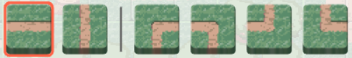
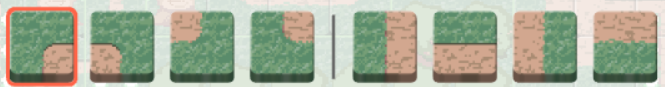
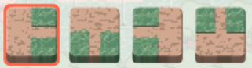

# Constraint Programming Modeling

## Tiles

Each tile type has unique figure:

- tiles with only roads:

- tiles with only clearings:

- tiles with both roads and clearings:

- tiles with stump:

## Notations

### Geometry

| Meaning                                                    | Notation  | Type          |
| :--------------------------------------------------------- | :-------- | :------------ |
| All grids in the puzzle region                             | $V$       | Set of scalar |
| All empty grids in the puzzle region                       | $\hat{V}$ | Set of scalar |
| All edges in the puzzle region                             | $E$       | Set of scalar |
| Edges of grid $v$, $v \in V$                               | $E(v)$    | Set of Scalar |
| Grids adjacent to grid $v$, $v \in V$                      | $V(v)$    | Set of Scalar |
| 4 cardinal directions                                      | $D$       | Set of scalar |
| Direction from grid $v$ to edge $e$, $v \in V, e \in E(v)$ | $D(v,e)$  | Scalar        |
| Direction from grid $u$ to grid $v$, $u \in V, v \in V(u)$ | $D(u,v)$  | Scalar        |

### Tiles

| Meaning                                              | Notation     | Type              |
| :--------------------------------------------------- | :----------- | :---------------- |
| All avaiable tile types                              | $T$          | Set of scalar     |
| Tile types with roads                                | $\hat{T}$    | Set of scalar     |
| Flow through edge at direction $d$ of tile $t$       | $f_{1}(t,d)$ | Scalar            |
| Flow through grid at direction $d$ of tile $t$       | $f_{2}(t,d)$ | Scalar            |
| Flows through edge $e$, $e \in E$                    | $F_1(e)$     | Set of expression |
| Flows through grid $v$, $v \in V$                    | $F_2(v)$     | Set of expression |
| Flow between grid $u$ and $v$, $u \in V, v \in V(u)$ | $f(u,v)$     | Expression        |

### Decisions

| Meaning                                                      | Notation | Type            |
| :----------------------------------------------------------- | :------- | :-------------- |
| Whether place tile $t$ on grid $v$, $t \in T, v \in \hat{V}$ | $x_{vt}$ | Binary variable |

### Auxiliaries

| Meaning                                                                        | Notation               | Type             |
| :----------------------------------------------------------------------------- | :--------------------- | :--------------- |
| The order of grid $v$ on blooming tree, $v \in V$                              | $bord_{v}$             | Integer variable |
| Whether grid $u$ is parent of grid $v$ on blooming tree, $u \in V, v \in V(u)$ | $bp_{uv}$              | Binary variable  |
| Blooming source of grid $v$, $v \in V$                                         | $bs_{v}$               | Integer variable |
| Whether grid $v$ need blooming, $v \in V$                                      | $\text{needBloom}_{v}$ | Binary variable  |

## Constraints

### Aligned Figures

#### Requirement

Figures on two adjacent tiles must align.

#### A naive formulation

If a grid select a tile, then its adjacent grids can select from only a subset of tiles:

$$\forall (u, v) \in E, t\in T, \quad  x_{ut} \le \sum_{t^{\prime} \in \text{subset}(T, t)} x_{v t^{\prime}}$$

The formulation has following drawbacks:

- **Tile types are tightly coupled**. If I add a new tile type $t$, I must look up all existing tiles to determine $\text{subset}(T, t)$.
- **Inequality is weak for constraint propagation**.

#### Adopted formulation

_Flow conservation_ can describe compatibility. Each tile has flow through its edges, all flows through the same edge must equal:

$$
\forall v \in V, e \in E(v) \quad F_1(e) \cup \{\sum_{t \in T} x_{vt} \cdot f_{1}(t,D(v,e))\}\\
\forall e \in E, \quad \text{AllEqual}(F_1(e))
$$

Advantages of the formulation over the naive one:

- **Tile types are loosely coupled**. If I add a new tile type $t$, what I need to do is adding flow parameter $f_{1}(t,d)$ over 4 cardinal directions. I don't need care existing tiles are what types.
- **Equality is strong for constraint propagation**.

### Paired Stumps

#### Requirement

Stump tiles must always appear in matching pairs:

- Arrow figures of two stumps must point to each other.
- There must be only a road tile between two stumps.

#### Adopted formulation

The key is still _flow conservation_. But the flow is not through edge but grid. All flows through the same grid must equal:

$$
\forall u \in V, v \in V(u), \quad F_2(v) \cup \{\sum_{t \in T} x_{vt} \cdot f_{2}(t,D(u,v))\}\\
\forall v \in V, \quad \text{AllEqual}(F_2(v))
$$

There must be only a road tile between two matching stumps:
If there is flow on a grid, the grid must select a tile with roads:

$$
\forall v \in V, \quad \sum_{f \in F_2(v)} f \le M \cdot \sum_{t \in \hat{T}} x_{vt}
$$

### Bloom

#### Requirement

Every road tile should bloom. To make a road tile bloom:

- between two matching stumps (the source of blooming), or adjacent to a blooming road tile (just transmit blooming).
- can't connect to multiple blooming sources.

#### Adopted formulation

_Tree_ can be used to describe such source and transmission mechanics. A tree structure ususally includes two parts:

- **Parent-Children**: Every node in the tree must have a parent or it has exemption (e.g. itself is root node).
  $$
  \forall v \in V, \quad \text{needBloom}_{v} = \text{isBloomSource}(v) \cdot \text{asBloomSource}(v) + \sum_{u \in V(v)} bp_{uv}
  $$
- **No Cycle**: Every node can't trace back to itself along parent-children chain.
  $$
  \forall u \in V, v \in V(u), \quad bp_{uv} \rightarrow bord_{u} + 1 \le bord_{v}
  $$

Since a road tile can connect to two blooming sources, first we must record blooming source of each grid:

$$
\forall u \in V, v \in V(u), \quad bp_{uv} \rightarrow bs_{u} = bs_{v}
$$

Second we should make sure blooming sources of a grid and its **connected** neighbors are all the same:

$$
\forall u \in V, v \in V(u), \quad \text{needBloom}(u) \& \text{needBloom}(v) \& f_{uv}\gt 0 \rightarrow  bs_{u} = bs_{v}

$$

## No goods for enumeration
